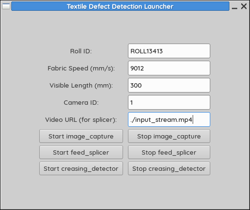

## Textile Defect Detection System

This is a modular C++ project built for inspecting fabric defects—like creasing—on a stenter machine. It works by capturing high-resolution images or slicing frames from a video feed, then running edge detection to identify visible issues. The goal is reliable, real-time inspection suitable for industrial environments.

It uses OpenCV for image processing and GTK for a lightweight GUI. Everything is designed to be scriptable, portable, and easily integrated with existing ERP or IoT infrastructure.

### Overview

There are four main components in this system:

- `image_capture`: Captures high-resolution images from a camera at timed intervals based on fabric speed.
- `feed_splicer`: Pulls frames from a video stream (RTSP, m3u8, etc.) at fixed spacing determined by fabric motion.
- `creasing_detector`: Applies Canny edge detection to each image and saves the output.
- `fabric_gui_launcher`: A simple GTK-based GUI that starts and stops the above binaries with user-supplied parameters.

Each component is a standalone executable and can run independently or be controlled via the GUI.

<p align="center">
  
  
</p>

### Folder Structure
```
/usr/bin/
├── image_capture
├── feed_splicer
├── creasing_detector
└── fabric_gui_launcher

/usr/share/textile-defects/assets/
├── still_images/ # Output from image_capture
├── spliced_frames/ # Output from feed_splicer
└── processed_images/ # Output from creasing_detector
```

## Example Usage
### Manual capture using camera
```bash
image_capture ROLL20250707 1333 800 0
```
### Frame slicing from a video stream
```bash
feed_splicer ROLL20250707 1333 800 rtsp://your-stream-url
```
### Start the detector
```bash
creasing_detector
```
Or, just use:
```
fabric_gui_launcher
```
This will bring up a GTK window with input fields and buttons to control everything.

### Build Instructions

Make sure OpenCV and GTK3 are installed on your system:
```bash
sudo apt install build-essential cmake libopencv-dev libgtk-3-dev
```
Then build:
```bash
git clone https://github.com/thunder-thigh/textile-defects-screening
cd textile-defects-screening
mkdir build && cd build
cmake ..
cmake --build .
```
The build process will copy all compiled binaries into build/textile-defects-screening/usr/bin/ to match Debian packaging structure.

### Packaging

The application is structured with system-wide install locations in mind:
Binaries are placed in /usr/bin/
All output folders (still_images, spliced_frames, processed_images) live under /usr/share/textile-defects/assets/
To package, use standard Debian tools like dpkg-deb or cpack.

### Dependencies

OpenCV 4.x
GTK 3
C++17 or later

### Author

Aashutosh Singh Baghel
aashubaghel08@gmail.com
